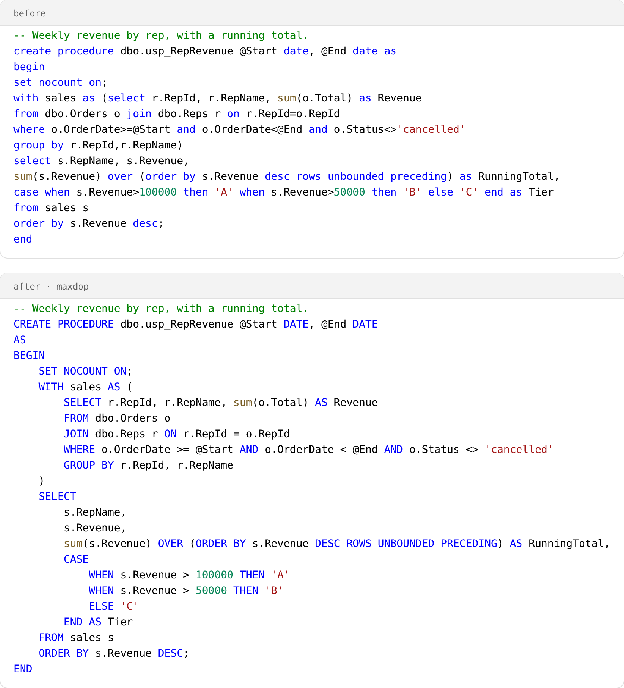
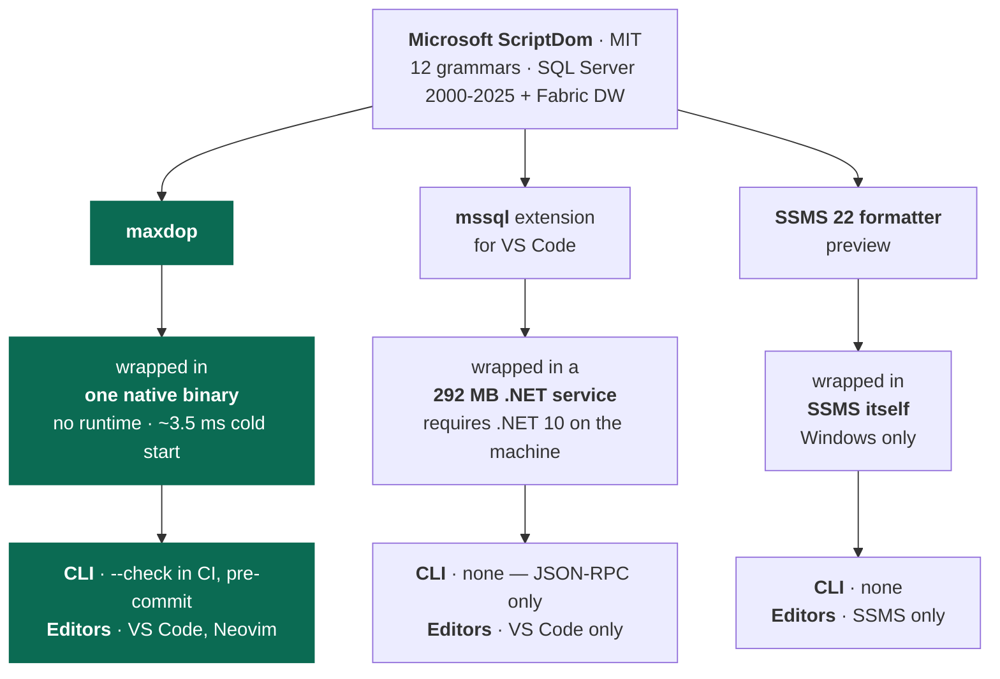

# maxdop — Max Degree of Prettiness for your T-SQL

**A T-SQL formatter that runs in CI, understands the whole language, and checks its own work.**

One static binary. No runtime to install. The formatter is free and MIT — all of it.

<picture>
  <source media="(prefers-color-scheme: dark)" srcset="docs/images/before-after-dark.png">
  
</picture>

```sh
maxdop query.sql       # formatted SQL to stdout
maxdop --write src/    # format every .sql under src/, in place
maxdop --check src/    # fail the build if anything would change
```

Windows, macOS, Linux and Alpine; x64 and arm64. ~3.5 ms cold start. The binary in your editor is
the same one your pipeline runs.

Style lives in a `.maxdop.json` at your repo root, so the team agrees once instead of per editor.

---

## Why not the formatter you already have?

### 1. Most SQL formatters never parse your SQL

They split it into tokens and guess. That works until the shape of the code matters. These are real
outputs:

<table>
<thead>
<tr><th align="left">you wrote</th><th align="left"><code>sql-formatter</code> 15.8.2, <code>tsql</code></th><th align="left"><code>maxdop</code></th></tr>
</thead>
<tbody>
<tr>
<td valign="top">

```sql
if @a = 1
begin
if @b = 2
begin
select 1;
end
end
```

</td>
<td valign="top">

```sql
-- nesting lost
if @a = 1 begin if @b = 2 begin
select
  1;

end end
```

</td>
<td valign="top">

```sql
IF @a = 1
BEGIN
    IF @b = 2
    BEGIN
        SELECT 1;
    END
END
```

</td>
</tr>
<tr>
<td valign="top">

```sql
SELECT 1 << 1 >> 1;
SELECT 'a' || 'b';
```

</td>
<td valign="top">

```sql
-- no longer valid SQL
SELECT
  1 < < 1 > > 1;

SELECT
  'a' | | 'b';
```

</td>
<td valign="top">

```sql
SELECT 1 << 1 >> 1;
SELECT 'a' || 'b';
```

</td>
</tr>
</tbody>
</table>

maxdop is built on [ScriptDom](https://github.com/microsoft/sqlscriptdom), Microsoft's own T-SQL
parser — the one behind DacFx and SQL database projects. Twelve grammars, SQL Server 2000 to 2025
plus Fabric DW. It reads stored procedures, `GO` batches and 2000-era syntax the way the server does.

### 2. Microsoft's formatters can't leave the editor

maxdop shares its parser with Microsoft's own two formatters, so all three understand your code
equally well. What differs is where you can run them:



<sub>Sizes and versions measured August 2026, and they will move — the shape of the diagram is the
durable part, not the numbers in it.</sub>

A formatter with no command line cannot gate a pull request. Style only becomes the team's style
when something fails the build.

Expect the *output* of all three to converge — same parser, same problems. Line breaks are not a
durable argument. Reach is.

### 3. It checks its own work

Every other formatter here hands you the result and trusts it. maxdop re-parses what it produced and
compares the token stream, the tree and the comments against your input. If anything differs you get
your original file back, untouched, and a distinct exit code.

That is a stance about who carries the risk. A formatter that declines to format is a support ticket
for a vendor and a promise kept for a linter.

Measured against 2,215 real-world files — AdventureWorks and WideWorldImporters, the First Responder
Kit, Ola Hallengren's Maintenance Solution, sp_WhoIsActive, and ScriptDom's own test suite —
formatted once per configuration option:

| | |
| --- | --- |
| Refused, crashed, or non-idempotent | **0**, in every variant |
| Comments lost | **0** of 11,261 |
| Token coverage, corpus-wide | **98.6%** |

[How that is measured →](docs/safety.md)

---

## Install

One static executable. No .NET runtime, no Node, no installer, nothing fetched on first run.

### Package managers

| | |
| --- | --- |
| **Scoop** (Windows) | `scoop bucket add maxdop https://github.com/pagebrooks/scoop-maxdop`<br>`scoop install maxdop` |

More are on the way. If you maintain a package for a manager not listed here, an issue or a PR to
[`packaging/`](packaging/) is welcome.

### Download it yourself

Pick your platform from [the latest release](../../releases/latest) — `linux-x64`, `linux-arm64`,
`linux-musl-x64` (Alpine), `osx-x64`, `osx-arm64`, `win-x64` or `win-arm64`.

**macOS and Linux**

```sh
V=0.1.0; RID=linux-x64          # or linux-arm64, linux-musl-x64, osx-x64, osx-arm64

curl -fsSLO "https://github.com/pagebrooks/maxdop/releases/download/v$V/maxdop-$V-$RID.tar.gz"
tar -xzf "maxdop-$V-$RID.tar.gz"
sudo install "maxdop-$V-$RID/maxdop" /usr/local/bin/
```

**Windows** — download `maxdop-<version>-win-x64.zip` (or `win-arm64`), extract it, and put
`maxdop.exe` somewhere on your `PATH`.

<sub>The archives are unsigned, so macOS Gatekeeper and Windows SmartScreen warn on a direct
download. Installing through a package manager or the VS Code extension avoids that.</sub>

### Verify what you downloaded

Every archive carries [build provenance](https://github.com/actions/attest-build-provenance) — proof
that these exact bytes came out of this repository's release workflow, which a checksum alone cannot
give you, since anyone who could replace the binaries could rewrite `SHA256SUMS` beside them.

```sh
gh attestation verify "maxdop-$V-$RID.tar.gz" --repo pagebrooks/maxdop
```

`SHA256SUMS` is attached to every release as well.

### In an editor

The [VS Code extension](https://marketplace.visualstudio.com/items?itemName=pbrooks.maxdop) bundles
the binary for your platform, so it needs none of the above. Neovim works through
[conform.nvim](https://github.com/stevearc/conform.nvim), and anything that can pipe a buffer through
a command works too — the whole interface is stdin in, stdout out, exit code back.

[Editor setup →](docs/editors.md)

## Use


```sh
maxdop query.sql                # stdout
maxdop --write src/             # a file or a directory, searched to the bottom
maxdop --check src/             # exit 1 if anything would change
maxdop --parser-version 2016    # pin the grammar
cat query.sql | maxdop          # stdin to stdout, how editors call it

git diff --name-only -z | maxdop --check --files-from -   # only what changed, no git dependency
maxdop --write-baseline src/                              # adopt on a codebase already written
```

[Exit codes and CLI reference →](docs/cli.md)

## Configuration

One `.maxdop.json` at the repo root, committed next to the code it formats. The nearest one at or
above the file being formatted wins.

```json
{
  "maxWidth": 100,
  "indentSize": 4,
  "useTabs": false,
  "keywordCase": "upper",
  "leadingCommas": false,
  "alwaysBreakSelectList": false,
  "alwaysBreakWhere": false,
  "maxBlankLines": 1,
  "parserVersion": "2022",
  "initialQuotedIdentifiers": false,
  "exclude": ["db/generated/**", "*.gen.sql"]
}
```

There are no editor-level formatting settings on purpose. A repo formats the same way whoever opens
it.

## Documentation

| | |
| --- | --- |
| [Safety](docs/safety.md) | What maxdop guarantees, how it is verified, and what it refuses to touch |
| [Comparison](docs/comparison.md) | The other ten T-SQL formatters, and what actually separates them |
| [CLI](docs/cli.md) | Flags, exit codes, grammar versioning, migration scripts |
| [Editors](docs/editors.md) | VS Code, Neovim, plain Vim |
| [Development](docs/development.md) | Repo layout and building from source |

## License

MIT — see [LICENSE](LICENSE). All of it, including the CLI and using it in CI. ScriptDom is MIT and
used as a NuGet dependency.
