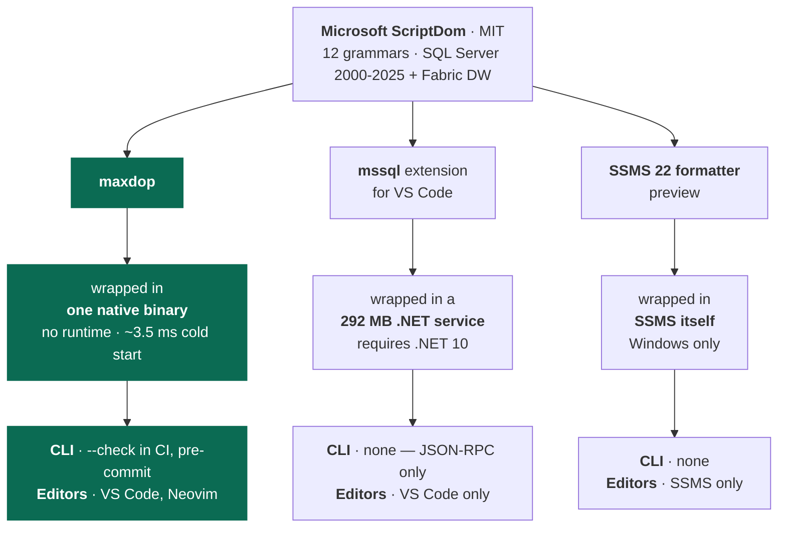

# maxdop - The Max Degree of Prettiness for your T-SQL

**A T-SQL formatter that runs in both **Text Editors and CI**, understands the whole language, and checks its own work.**

* One static binary. 
* No runtime to install. 
* The formatter is free and MIT licensed, all of it.

<picture>
  <source media="(prefers-color-scheme: dark)" srcset="docs/images/before-after-dark.png">
  
</picture>

```sh
maxdop query.sql       # formatted SQL to stdout
maxdop --write src/    # format every .sql under src/, in place
maxdop --check src/    # fail the build if anything would change
```

Windows, macOS, Linux and Alpine; x64 and arm64. ~3.5 ms cold start. The binary in your editor is
the same one your pipeline runs.

Style lives in a `.maxdop.json` at your repo root, so the team agrees once instead of per editor.

---

## Why not the formatter you already have?

### 1. Parsing vs. Tokenization 

Most SQL formatters never parse your SQL. They split it into tokens and guess. That works until the shape of the code matters. These are real
outputs:

<table>
<thead>
<tr><th align="left">you wrote</th><th align="left"><code>sql-formatter</code> 15.8.2, <code>tsql</code></th><th align="left"><code>maxdop</code></th></tr>
</thead>
<tbody>
<tr>
<td valign="top">

```sql
if @a = 1
begin
if @b = 2
begin
select 1;
end
end
```

</td>
<td valign="top">

```sql
-- nesting lost
if @a = 1 begin if @b = 2 begin
select
  1;

end end
```

</td>
<td valign="top">

```sql
IF @a = 1
BEGIN
    IF @b = 2
    BEGIN
        SELECT 1;
    END
END
```

</td>
</tr>
<tr>
<td valign="top">

```sql
SELECT 1 << 1 >> 1;
SELECT 'a' || 'b';
```

</td>
<td valign="top">

```sql
-- no longer valid SQL
SELECT
  1 < < 1 > > 1;

SELECT
  'a' | | 'b';
```

</td>
<td valign="top">

```sql
SELECT 1 << 1 >> 1;
SELECT 'a' || 'b';
```

</td>
</tr>
</tbody>
</table>

maxdop is built on [ScriptDom](https://github.com/microsoft/sqlscriptdom), Microsoft's own T-SQL
parser. It includes twelve grammars, SQL Server 2000 to 2025
plus Fabric DW. It reads stored procedures, `GO` batches and syntax the way the server does.

### 2. Microsoft's formatters can't leave the editor

Microsoft's own formatters use ScriptDom, so they have the potential to understand and format your code equally well. However, there formatters are bundled in tightly into their products: 



A formatter with no command line cannot gate a pull request. Style only becomes the team's style when something fails the build.

### 3. Self-verification

maxdop re-parses what it produced and compares its significant token stream against your input's, token by token, with a second check for
the comments. Identical tokens mean an identical parse tree, so this delivers tree equivalence rather than approximating it. If anything
differs you get your original file back, untouched, and a distinct exit code.


### 4. Validation
maxdop has been measured against 2,215 real-world files including AdventureWorks, WideWorldImporters, the First Responder
Kit, Ola Hallengren's Maintenance Solution, sp_WhoIsActive, and ScriptDom's own test suite (*formatted once per configuration option*).

|Test Results||
| --- | --- |
| Refused, crashed, or non-idempotent | **0**, in every variant |
| Comments lost | **0** of 11,385 |
| Token coverage, corpus-wide | **98.6%** |

[More about Safety and Validation →](docs/safety.md)


## Installation

Maxdop is compiled as one static executable and works across multiple platforms. No additional runtimes or platform support (.NET, Node, etc.) are needed. It can run inside a text editor as a formatter, as a standalone CLI tool, and it can run in a CI pipeline as a quality gate.

## In a Text Editor

The following editors are tested and supported for formatting T-SQL.

* **VS Code extension** - packaged as an [extension](https://marketplace.visualstudio.com/items?itemName=pbrooks.maxdop) which bundles
the binary for your platform.

* **Neovim** - through [conform.nvim](https://github.com/stevearc/conform.nvim).

* **Helix** 

* **Other Editors** - Any editor that can pipe a buffer through
  a command works too — the whole interface is stdin in, stdout out, exit code back.


[Editor setup instructions →](docs/editors.md)


### Package managers

| | |
| --- | --- |
| **Homebrew** (macOS, Linux) | `brew install pagebrooks/tap/maxdop` |
| **Scoop** (Windows) | `scoop bucket add maxdop https://github.com/pagebrooks/scoop-maxdop`<br>`scoop install maxdop` |
| **pip / uv** (any platform) | `pip install maxdop`<br>`uvx maxdop --check src/` |

The [PyPI package](https://pypi.org/project/maxdop/) is the same static binary in a wheel, no Python
runs when you format a file.

**Note:** Support for more package mamanagers are on the way. If you maintain a package for a manager not listed here, an issue or a PR to
[`packaging/`](packaging/) is welcome.

### Manual Install

Pick your platform from [the latest release](../../releases/latest) — `linux-x64`, `linux-arm64`,
`linux-musl-x64` (Alpine), `osx-x64`, `osx-arm64`, `win-x64` or `win-arm64`.

**macOS and Linux**

```sh
V=0.1.2; RID=linux-x64          # or linux-arm64, linux-musl-x64, osx-x64, osx-arm64

curl -fsSLO "https://github.com/pagebrooks/maxdop/releases/download/v$V/maxdop-$V-$RID.tar.gz"
tar -xzf "maxdop-$V-$RID.tar.gz"
sudo install "maxdop-$V-$RID/maxdop" /usr/local/bin/
```

**Windows** 

Download `maxdop-<version>-win-x64.zip` (or `win-arm64`), extract it, and put
`maxdop.exe` somewhere on your `PATH`.


## CLI Usage


```sh
maxdop query.sql                # stdout
maxdop --write src/             # a file or a directory, searched to the bottom
maxdop --check src/             # exit 1 if anything would change
maxdop --parser-version 2016    # pin the grammar
cat query.sql | maxdop          # stdin to stdout, how editors call it

git diff --name-only -z | maxdop --check --files-from -   # only what changed, no git dependency
maxdop --write-baseline src/                              # adopt on a codebase already written
```

[Exit codes and CLI reference →](docs/cli.md)

### Pre-commit Usage

```yaml
repos:
  - repo: https://github.com/pagebrooks/maxdop
    rev: v0.1.2
    hooks:
      - id: maxdop          # rewrites files, then fails so you re-stage
      - id: maxdop-check    # fails without touching anything
```

pre-commit installs the binary itself, so nobody on the team has to have maxdop already. Exclusions
still come from `.maxdop.json`, not from the hook.


## Configuration

One `.maxdop.json` at the repo root, committed next to the code it formats. The nearest one at or above the file being formatted wins.

```json
{
  "maxWidth": 100,
  "indentSize": 4,
  "useTabs": false,
  "keywordCase": "upper",
  "leadingCommas": false,
  "recaseBuiltInFunctions": true,
  "alwaysBreakSelectList": false,
  "alwaysBreakWhere": false,
  "maxBlankLines": 1,
  "parserVersion": "2022",
  "initialQuotedIdentifiers": false,
  "exclude": ["db/generated/**", "*.gen.sql"]
}
```

`recaseBuiltInFunctions` gives built-in function names and global variables the configured keyword
case, so `getdate()` becomes `GETDATE()` and `@@rowcount` becomes `@@ROWCOUNT`. This is the one
casing rule maxdop applies from a list of names rather than from the parse tree, so it is the one you
can switch off — everywhere else, a word is recased only where the grammar proves it cannot be a
name.

Even on, it is narrow. Only an unqualified, undelimited call is touched: `dbo.MyFunc(...)`,
`dbo.Len(...)` and `[len](...)` keep the casing you wrote, because SQL Server needs at least a
two-part name to reach a function of yours. And only a documented global variable is touched — if you
have a `DECLARE @@MyVar INT` (legal T-SQL, and indistinguishable from `@@ROWCOUNT` to the parser), it
keeps every character you wrote.

There are no editor-level formatting settings on purpose. A repo formats the same way whoever opens
it.

## Documentation

| | |
| --- | --- |
| [Safety](docs/safety.md) | Safety guarantees made by maxdop |
| [Comparison](docs/comparison.md) | Comparison of maxdop against other formatters |
| [CLI](docs/cli.md) | Flags, exit codes, grammar versioning, migration scripts |
| [Editors](docs/editors.md) | VS Code, Neovim, plain Vim, Helix |
| [Development](docs/development.md) | Repo layout and building from source |

## License

MIT see [LICENSE](LICENSE). ScriptDom is MIT and
used as a NuGet dependency.
